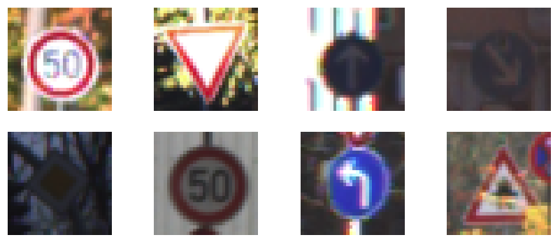
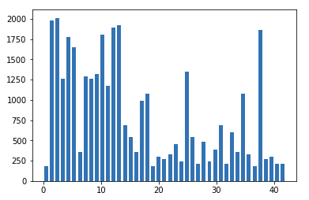
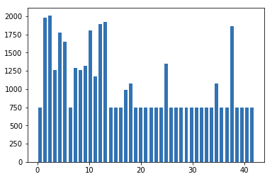
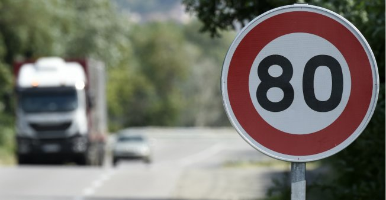
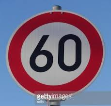
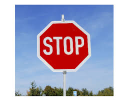
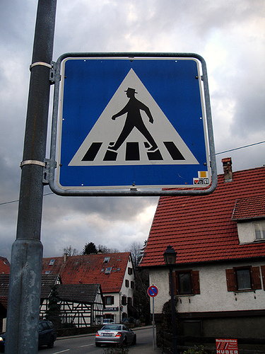

In the second project of the Udacity's Self-Driving Car Nanodegree, we are building a Convolutional Neural Network to classify traffic signs.

## The Process

### Data set summary and exploration

First we load our data and analyse what we have to work with. The data is already split into training, validation and test sets. The training set is naturally the largest one with 34799 samples, next the testing set with 12630 samples and the validation set has only 4410 samples. 

Below we have displayed some random images in the training set. 

### Preprocessing the data

In order to get the best out of our training later, we need to preprocess the training set.
To do so, we investigate the number of images we have for each dataset, the training, validation and test set. And next how many images we have for each label.

The distribution displayed above shows that some labels have very few images in the training set, while other labels have a large number of samples. 
Having an uneven distribution of labels will often cause the model to overfit on the labels with many samples and underfit on the labels with many. 
Therefore we need to add more images to the labels with few samples, using something called image augmentation. 
The idea behind image augmentation is to stack lots of copies and perform transformation on these copies to generate new samples we can add to the dataset. 

Looking at our distribution, we decide to add more samples to all labels that have less than 750 samples. To generate these samples we chose to use the following image augmentation techniques:

- Translate: Performs translate on the image, which means to randomly shift the image between -10 to 10 pixels.
- Scale: Rescale the image with a scale factor between 1/1.6 and 1.6
- Warp: Warm an image according to a given coordinate transforming
- Brightness: Changes brightness in images, effective to create images taken at night or day.

Each of the augmentation methods are used on the new samples, which creates a new training set with the new distribution:

This should help prevent our model from over-fit on the classes with high labels.

### Defining our Convolutional Neural Network model

The CNN model I have chosen to build, is a simple LeNet architecture with an added dropout layer before the last fully connected layers. Dropout is a technique used to improve over-fit models. And as I wanted to run a good amount of epochs on the training set, I wanted to have a dropout layer to avoid the model to overfit on the training set. 

In summary the model has the following layers:

| Layer # | Type | Input | Output | Activation
:-------------------------:|:-------------------------:|:-------------------------:|:-------------------------:|:-------------------------:
1 | Convolutional | 32x32x1 | 28x28x6 | relu
1 | Pooling | 28x28x6 | 14x14x6 | -
2 | Convolutional | 14x14x6 | 10x10x16 | relu
2 | Pooling | 10x10x16 | 5x5x16 | -
2 | Flatten | 5x5x16 | 400 | -
3 | Fully Connected | 400 | 120 | relu
3 | 50% Dropout | - | - | - |
4 | Fully Connected | 120 | 84 | relu.
5 | Fully Connected | 84 | # of classes | -

## Experiment and results

The model is trained with the following parameters: 
- Learning rate to 0.001, which defines how quickly the model will adjust on new discoveries. Having a high learning rate, will make the model adjust a lot for new discoveries, while having a low learning rate will make the model adjust less. 
- Epochs is defined to be the number of rounds the model trains on the entire data. I set this to be 50 and did not change this as I noticed the model did not improve much already after the first 20 epochs.
- Batch size is the number of examples in one forward/backward pass. Higher leads to faster training process, but in return requires more memory. I set mine to 64.
- The model is optimized using the Adam optimizer which is an extension of the stochastic gradient descent

### Results

| Data set | Accuracy
:-------------------------:|:-------------------------:
Validation accuracy | 0.967
Test set | 0.949

### Testing on new data

I found 5 random traffic signs from the world wide web that I wanted to test my models performance on.

| Image             |  Model prediction | Actual |
:-------------------------:|:-------------------------:|:-------------------------:
 <!-- .element height="250px" width="250px" --> |  Road Work  | Road work
 <!-- .element height="250px" width="250px" --> | Priority Road | Speed limit (80km/h)
 <!-- .element height="250px" width="250px" --> | Speed limit (60 km/h) | Speed limit (60 km/h)
 <!-- .element height="250px" width="250px" --> | Speed limit (100 km/h) | Stop
 <!-- .element height="250px" width="250px" --> | No passing | Pedestrians

As seen in the table above, the model got only 2 out of the 5 images correctly, giving it an accuracy of 0.4. This might be because the images I found on the web is very different from the ones in the training set, 

Next I checked the top 5 probability for the new images. For the two correct images, it showed a 100% probability for the ones it got correct, and 99% sure on the pedestrian image. However for the stop sign and 80 km traffic sign, the model was very uncertain. 

The tables below shows the top 5 prediction for the stop sign and Speed limit (80 km/h) sign, which the model was very uncertain of.

| # | Probability | Prediction
:-------------------------:|:-------------------------:|:-------------------------:
 1 | 0.588 | Speed limit (100 km/h) 
 2 | 0.389 | Priority road
 3 | 0.02 | Speed limit (80km/h)
 4 | 0.0 | -
 5 | 0.0 | -
 
 
 
 
 | # | Probability | Prediction
 :-------------------------:|:-------------------------:|:-------------------------:
  1 | 0.700 | Priority road
  2 | 0.251 | Children crossing
  3 | 0.019 | Vehicles over 3.5 metric tons prohibited
  4 | 0.016 | No passing
  5 | 0.010 | End of no passing
  
  As one can see for these two images, the model was not even close to being able to make the correct predictions. This might show that a slight change in the signs, or new images from the training set can completely make the model insecure. Therefore we can draw the conclusion that the model is able to make good prediction following the signs in the set, but once it gets signs a little out of its initial training set, it fails to perform. This is very typical when training a neural network, and therefore important to make sure to train the model for multiple varieties of signs to make it able to learn as many cases as possible.
 
 
 

